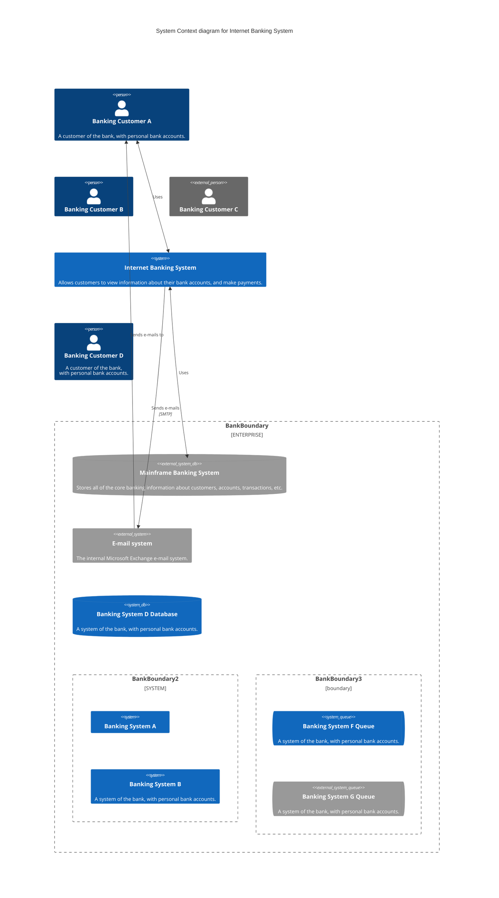

```geojson
{
  "type": "FeatureCollection",
  "features": [
    {
      "type": "Feature",
      "properties": {"city": "Ciao"},
      "geometry": {
        "type": "Point",
        "coordinates": [
          55.5136433,
          25.4052165
        ]
      }
    },
    {
      "type": "Feature",
      "geometry": {
        "type": "Point",
        "coordinates": [
          -61.4630653,
          10.4056994
        ]
      }
    }
  ]
}
```

```geojson
{
  "type": "FeatureCollection",
  "features": [{
    "properties": {},
    "type": "Feature",
    "geometry": {
      "type": "MultiPoint",
      "coordinates": [
        [55.5136433, 25.4052165],
        [54.37, 24.47],
        [55.27, 25.25]
      ]
    }
  }]
}
```

```geojson
{
  "type": "FeatureCollection",
  "features": [
    {
      "type": "Feature",
      "id": 1,
      "properties": {
        "ID": 0
      },
      "geometry": {
        "type": "Polygon",
        "coordinates": [
          [
              [-90,35],
              [-90,30],
              [-85,30],
              [-85,35],
              [-90,35]
          ]
        ]
      }
    }
  ]
}
```




